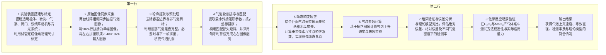

```mermaid
flowchart LR
    subgraph 第一行
        direction LR
        A[1 实验装置搭建与标定<br/>搭建透明柱体、针尖、气泵、阀门、双线阵相机与背光系统；<br/>利用试管完成像素物理尺寸标定]
        B[2 原始图像同步采集<br/>两台线阵相机同步拍摄气泡图像；<br/>每1024行拼接为单幅图像，再左右拼接形成2048×1024输入图像]
        C[3 轮廓提取与预处理<br/>去除容器边界与非气泡目标；<br/>判断底部气泡是否完整，必要时与下一帧拼接；<br/>填充气泡孔洞]
        D[4 气泡轮廓排序与匹配<br/>提取最小外接矩形参数，按y坐标排序；<br/>构建匹配损失矩阵，并采用匈牙利算法完成左右图像配对]
        A --> B --> C --> D
    end

    subgraph 第二行
        direction LR
        E[5 动态畸变矫正<br/>结合匹配气泡垂直像素差和两相机高度差，<br/>计算垂直像素尺寸与矫正系数，实现图像动态复原]
        F[6 气泡参数计算<br/>基于矫正图像计算气泡上升速度与等效直径]
        G[7 结果验证与误差分析<br/>与理论模型对比，评估绝对误差、相对误差及不同气泡密度下的检测率]
        H[8 化学反应场景验证<br/>在H₂O₂与MnO₂产气体系中测试方法稳定性与实际应用潜力]
        I[输出结果<br/>获得气泡上升速度、等效直径、检测率及与理论模型的符合情况]
        E --> F --> G --> H --> I
    end

    D --> E
```